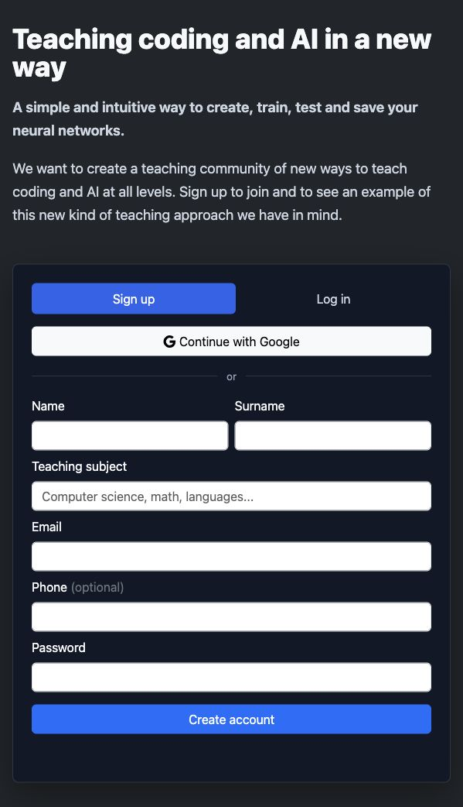
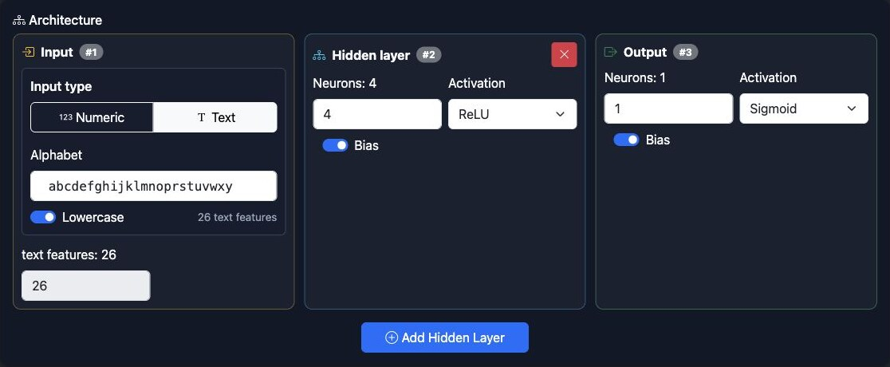
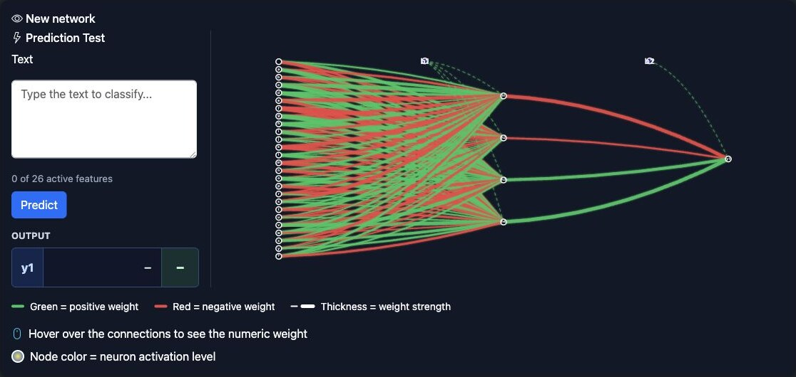
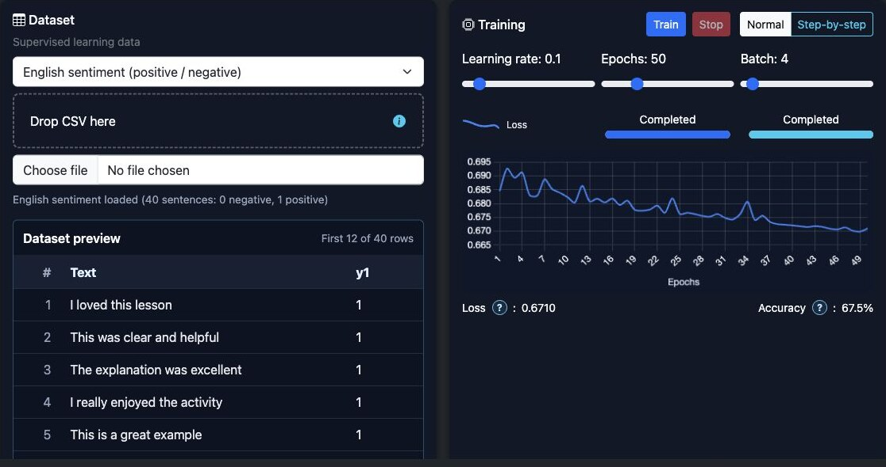
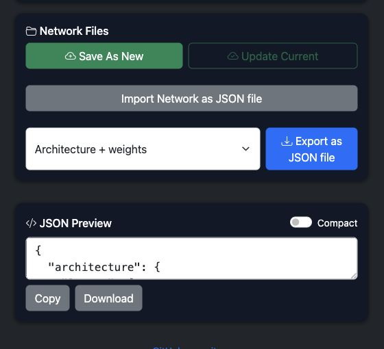
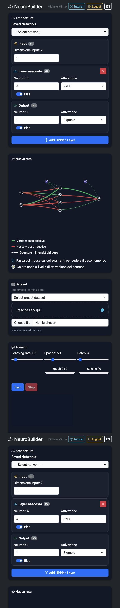

# NeuroBuilder

NeuroBuilder is a browser-based teaching tool for creating, training, testing,
visualizing and saving fully connected neural networks.

It is designed for teachers, students and anyone introducing coding, machine
learning and artificial intelligence through direct experimentation.

**[Open NeuroBuilder](https://micheleminno.github.io/neural-network-playground/)**



## The learning experience

Teachers can register with email and password or continue with Google. During
registration, NeuroBuilder collects the teacher's name, surname, teaching
subject and an optional phone number.

After signing in, the guided tutorial introduces the complete workflow:

1. Open, save, import or export a network.
2. Configure the horizontal input, hidden and output architecture.
3. Select a preset or import a dataset.
4. Train normally or follow the calculation step by step.
5. Inspect the visualization and test the model from its integrated Predict panel.
6. Inspect the complete network as JSON.

The application and tutorial are available in Italian and English. Changing
the language while the tutorial is open updates the current step immediately.

## Network builder

Build dense feed-forward networks and configure:

- Numeric inputs or text encoded as character frequencies
- Input and output dimensions
- Any number of hidden layers
- Neurons in each layer
- ReLU, sigmoid, tanh and linear activation functions
- Bias for hidden and output layers



## Interactive visualization and datasets

The network diagram updates as the architecture changes. Connections show the
sign and magnitude of each weight, while node colors represent activations.
Hovering over the visualization reveals numeric values.

Training can run normally or in **Step-by-step** mode. The guided mode loads one
example at a time and shows its desired output, the current prediction and the
loss inside the network visualization. Forward propagation advances one layer
per click; backpropagation then updates one layer per click from right to left,
highlighting the affected connections and their weight changes.

NeuroBuilder includes three presets:

- **XOR:** automatically configures 2 inputs and 1 output
- **Linear separation:** classifies points using `x + y > 1`
- **English sentiment:** configures text input and classifies English sentences as
  negative (`0`) or positive (`1`)

Custom supervised datasets can be imported as CSV files. Configure the network
before importing: the architecture determines how columns are interpreted.
Input columns must come first, followed by output columns.

For a network with 2 inputs and 1 output:

```csv
0,0,0
0,1,1
1,0,1
1,1,0
```

CSV requirements:

- Numeric values only
- Optional header row
- A consistent number of columns on every row
- Exactly `input count + output count` columns

### Text datasets

Switch the input type to **Text** to classify strings with a Bag of Characters
encoder. NeuroBuilder derives an alphabet from the imported text and converts
each example into normalized character frequencies plus an unknown-character
feature. The same alphabet and normalization settings are reused by Predict and
stored with the network.

Text CSV files use the first column for text and the remaining columns for
numeric targets. Header rows are optional and quoted text may contain commas:

```csv
text,label
"this lesson was useful",1
"the explanation was confusing",0
```



## Training and prediction

Training runs directly in the browser. Users can adjust learning rate, epochs
and batch size, monitor progress, stop training and inspect loss and accuracy.
The prediction panel accepts one value for each input and visualizes the model's
response. It is docked to the left of the network visualization so inputs and
results remain visible beside the model. In Text mode it provides a textarea
and shows how many character features are active before prediction.



## Accounts and cloud storage

Authentication and persistence are provided by Supabase. Each authenticated
teacher can:

- Save a network under their own account
- Update the currently loaded network
- Load or delete previously saved networks
- Access only their own saved models

Email/password and Google authentication are supported. OAuth redirects return
to the deployed GitHub Pages application.

## Import, export and JSON preview

Networks can be imported from JSON or exported in three modes:

- **Architecture only:** layers, dimensions, activations and bias settings
- **Weights only:** trained weights and bias values
- **Full network:** architecture, weights and dataset

The file controls and JSON preview share one workspace at the top of the app.
The preview updates immediately when choosing the full network, architecture or
weights export mode. It can be formatted, compacted or explored as a collapsible
tree before being copied or exported.



## Technology

- HTML5 and CSS3
- Vanilla JavaScript
- Bootstrap 5 and Bootstrap Icons
- Papa Parse
- Chart.js
- SVG network visualization
- Supabase Auth and PostgreSQL storage
- GitHub Pages

## Run locally

```bash
npm install
npm start
```

For authentication and cloud persistence, configure the Supabase project in
`supabase.js`, run `supabase/auth-and-user-networks.sql`, enable the desired
authentication providers and add the required callback and redirect URLs in
Supabase and Google Cloud. The current Google OAuth redirect is
`https://micheleminno.github.io/neural-network-playground/`.

## Full application



## Author

[Michele Minno](https://github.com/micheleminno)

## Copyright

Copyright © 2026 Michele Minno

NeuroBuilder is licensed under the GNU GPL v3.0.
See the [LICENSE](LICENSE) file for details.
