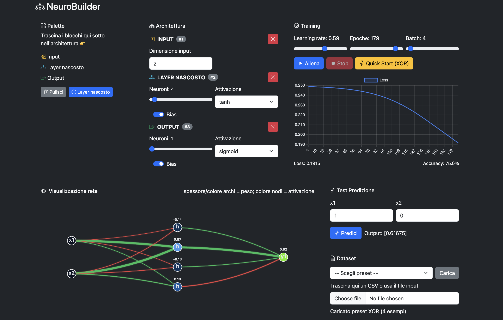

# 🧠 NeuroBuilder

Un’app web interattiva per **costruire, allenare e testare reti neurali** direttamente nel browser.
Sviluppata in **HTML / CSS (Bootstrap) / JavaScript** + **Chart.js** per i grafici.



---

## ✨ Funzionalità

* 📦 **Palette drag & drop** per aggiungere:

  * Input
  * Layer nascosti
  * Output
* 🖱️ **Interfaccia intuitiva** con:

  * Slider per numero neuroni
  * Attivazioni (ReLU, Sigmoid, Tanh, Linear)
  * Toggle per Bias
* 🎨 **Visualizzazione grafica**:

  * Nodi colorati in base all’attivazione
  * Archi verdi (peso positivo) / rossi (peso negativo)
  * Spessore proporzionale al peso
* 📊 **Training**:

  * Learning rate, epoche e batch configurabili
  * Grafico interattivo della loss
* ⚡ **Predizione**:

  * Inserisci input e visualizza subito output e colori dei nodi
* 📂 **Dataset**:

  * Preset XOR e Lineare
  * Caricamento CSV drag & drop
* 💾 **JSON Export/Import**:

  * Architettura
  * Pesi della rete

---

## 🚀 Come usarlo

1. **Clona il repo**

   ```bash
   git clone https://github.com/<tuo-utente>/neurobuilder.git
   cd neurobuilder
   ```

2. **Apri `index.html`** in un browser moderno (Chrome / Firefox / Edge).
   Non serve nessun server o backend, funziona tutto in locale.

3. **Trascina i layer** dalla palette per costruire la tua rete.

4. **Carica un dataset** (preset o CSV).

5. **Clicca Allena** → osserva in tempo reale loss, pesi e attivazioni.

---

## 🛠️ Tecnologie

* [Bootstrap 5](https://getbootstrap.com/) → interfaccia responsive
* [Chart.js](https://www.chartjs.org/) → grafico della loss
* **Vanilla JS** → motore rete neurale e training
* **SVG** → visualizzazione grafica della rete

---

## 📄 Licenza

Distribuito con licenza [GNU GENERAL PUBLIC LICENSE, Version 3](https://github.com/micheleminno/neural-network-playground?tab=GPL-3.0-1-ov-file#readme).

---

👨‍💻 Progetto realizzato da [Michele Minno](https://github.com/<tuo-utente>) + ChatGPT
